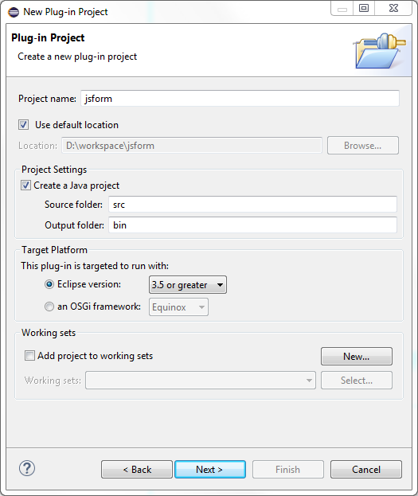
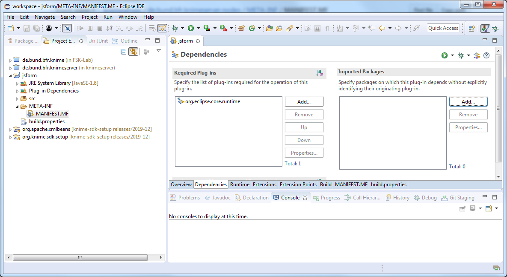

# Part 1 - Backend

The backend of a JavaScript KNIME node involves the Java classes for the node and some extra configuration files. These Java classes usually are the Node model and the view representation and value. The latter two persist the node data from/to JSON and exchange the data between the backend and the frontend.

The node model ideally does very little and mostly just process the inputs and outputs. When the type and number of inputs and outputs do not change, the backend stays unchanged and most of the time is the frontend that changes over time.

## Getting the KNIME SDK Setup
The KNIME SDK Setup project can be used as a minimal KNIME enviroment. Please read:
1. [SDK Setup](https://github.com/knime/knime-sdk-setup/tree/releases/2019-12#sdk-setup)
2. [Launch KNIME Analytics Platform](https://github.com/knime/knime-sdk-setup/tree/releases/2019-12#sdk-setup)
3. [Adding Extensions to the Target Definition (Advanced)](https://github.com/knime/knime-sdk-setup/tree/releases/2019-12#adding-extensions-to-the-target-definition-advanced)
4. [Explore KNIME Analytics Platform Source Code (Advanced)](https://github.com/knime/knime-sdk-setup/tree/releases/2019-12#explore-knime-analytics-platform-source-code-advanced)

## Node structure
Once the target is applied a new project can be created to accomodate the new node: 
`File > New > Other > Eclipse Plug-in`. In the dialog only the project name needs to be changed and the rest of settings can be left with the default values.



In the Content tab the properties can be left for now and the generation of the activator class can be disabled as it will not be used. The use of templates also needs to be checked out.

If the project was created properly, now Eclipse should open an Overview.


### KNIME dependencies
Before configuring the new plugin as a KNIME node the dependencies to KNIME need to be configured. Eclipse has a nice dependencies editor available from the project overview at the Dependencies tab (bottom). The existing dependencies there must be replaced with:

| Dependency | Description |
| - | - |
| org.knime.core | Core KNIME plugins: whole workbench |
| org.knime.workbench.repository | Extension mechanism for nodes |
| org.knime.js.core | KNIME JS nodes and related libraries (Jackson) |

These dependencies should be available if the target file loaded properly. If not, please go back to Getting the KNIME Setup.

### KNIME extensions
Once the KNIME dependencies are in place, the new plugin can be configured as a KNIME node from the Extensions tab of the project (bottom).

For every JS node written as a Javascript Component two extensions are needed: one javascript component (org.knime.js.core.javascriptComponent) that configures the node and it is the equivalent of a classic Java node and a web resources extension (org.knime.js.core.WebResources) that links to the JS and CSS files of the frontend.

Now please add a new extension with the Add button and choose `org.knime.js.core.javascriptComponent`. The new extension will be added and a panel on the right prompts the extension details.

| Attribute | Description |
| - | - |
| javascriptComponentID | Javascript component ID |
| name | Name displayed in the UI of the node (title) |
| namespace | JS namespace where the view is defined (see frontend) |
| implementationBundleID | ID of the web resources bundle. |
| init-method-name | Function called initially to create the UI. It is mandatory |
| validate-method-name | Function called by the frontend when closing the view to perform a final validation and cancels the view closure if returned false. If the view is validated it must return true. It is optional and can be skipped. |
| setValidationError-method-name | Helper to validate-method-name. It is optional and can be skipped. |
| getComponentValue-method-name | Function that returns the view (node) value. It is mandatory. |


Before creating the web resources bundle it is a good idea to create now the JS source folder that will contain the JS and CSS files. Inside the plugin project create a folder js-src/jsform: `File > New > Folder`. Inside this folder create two empty files named form.js and form.css.

Now please add a new extension with the Add button and choose `org.knime.js.core.WebResources`.


* webResourcesBundleID: Identifies the resources of this node and must match the implementationBundleID attribute of the JavaScript component or otherwise the backend and frontend will not be connected.
* name: Same as in JavaScript component.
* version: Version string.

If Eclipse created a resource please delete and a webResource by right clicking the webResource bundle, New and webResource. This will link the folder with the JS and CSS sources (js-src/jsform). Please enter as relativePathSource and relativePathTarget `js-src/jsform`.

Then add two importResource. The first will link to the Javascript file with relativePath `js-src/jsform/form.js` and type *JAVASCRIPT*. The second will link to the CSS file with relativePath `js-src/jsform/form.css` and type *CSS*.

Finally the node is configured and plugin.xml would look as:
```xml
<?xml version="1.0" encoding="UTF-8"?>
<?eclipse version="3.4"?>
<plugin>
   <extension
         point="org.knime.js.core.javascriptComponents">
      <javascriptComponent
            getComponentValue-method-name="getComponentValue"
            implementationBundleID="jsform.bundle"
            init-method-name="init"
            javascriptComponentID="jsform"
            name="JS Form"
            namespace="jsform">
      </javascriptComponent>
   </extension>
   <extension
         point="org.knime.js.core.webResources">
      <webResourceBundle
            debug="true"
            name="JS Form"
            usesDefine="false"
            version="1.0.0"
            webResourceBundleID="jsform.bundle">
         <webResource
               relativePathSource="js-src/jsform/"
               relativePathTarget="js-src/jsform/">
         </webResource>
         <importResource
               relativePath="js-src/jsform/form.js"
               type="JAVASCRIPT">
         </importResource>
         <importResource
               relativePath="js-src/jsform/form.css"
               type="CSS">
         </importResource>
      </webResourceBundle>
   </extension>

</plugin>
```

## Backend

