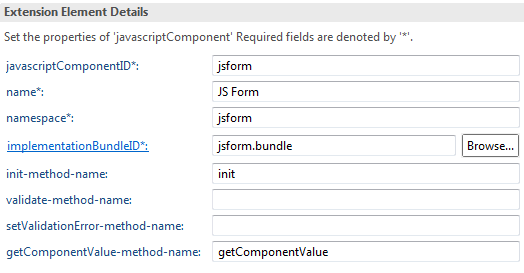
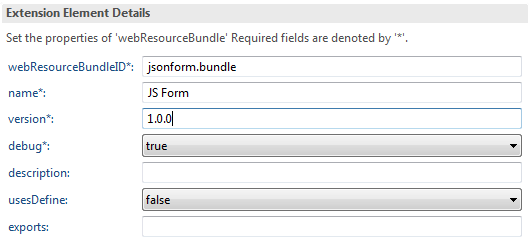

# Part 1 - Backend

The backend of a JavaScript KNIME node involves the Java classes for the node and some extra configuration files. These Java classes usually are the node model and the view representation and value. The latter two persist the node data from/to JSON and exchange the data between the backend and the frontend.

The node model ideally does very little and mostly just processes the inputs and outputs. When the type and number of inputs and outputs do not change, the backend stays unchanged and most of the time is the frontend that changes over time.

## Getting the KNIME SDK Setup
The KNIME SDK Setup project can be used as a minimal KNIME enviroment. Please read:
1. [SDK Setup](https://github.com/knime/knime-sdk-setup/tree/releases/2019-12#sdk-setup)
2. [Launch KNIME Analytics Platform](https://github.com/knime/knime-sdk-setup/tree/releases/2019-12#sdk-setup)
3. [Adding Extensions to the Target Definition (Advanced)](https://github.com/knime/knime-sdk-setup/tree/releases/2019-12#adding-extensions-to-the-target-definition-advanced)
4. [Explore KNIME Analytics Platform Source Code (Advanced)](https://github.com/knime/knime-sdk-setup/tree/releases/2019-12#explore-knime-analytics-platform-source-code-advanced)

## Node structure
Once the target is applied a new project can be created to accomodate the new node: 
`File > New > Other > Eclipse Plug-in`. In the dialog only the project name needs to be changed and the rest of settings can be left with the default values.


In the Content tab the properties can be left for now and the generation of the activator class can be disabled as it will not be used. The use of templates also needs to be checked out.

If the project was created properly, now Eclipse should open an overview.


### KNIME dependencies
Before configuring the new plugin as a KNIME node the dependencies to KNIME need to be configured. Eclipse has a nice dependencies editor available from the project overview at the Dependencies tab (bottom). The existing dependencies there must be replaced with:

| Dependency | Description |
| - | - |
| org.knime.core | Core KNIME plugins: whole workbench |
| org.knime.workbench.repository | Extension mechanism for nodes |
| org.knime.js.core | KNIME JS nodes and related libraries (Jackson) |

These dependencies should be available if the target file loaded properly. If not, please go back to [Getting the KNIME SDK Setup](#Getting-the-KNIME-SDK-Setup).

### KNIME extensions
Once the KNIME dependencies are in place, the new plugin can be configured as a KNIME node from the Extensions tab of the project (bottom).

For every JS node written as a Javascript Component two extensions are needed: one javascript component, *org.knime.js.core.javascriptComponent*, that configures the node and it is the equivalent of a classic Java node and a web resources extension, *org.knime.js.core.WebResources*, that links to the JS and CSS files of the frontend.

Now please add a new extension with the Add button and choose *org.knime.js.core.javascriptComponent*. The new extension will be added and a panel on the right prompts the extension details.

| Attribute | Description |
| - | - |
| javascriptComponentID | Javascript component ID |
| name | Name displayed in the UI of the node (title) |
| namespace | JS namespace where the view is defined (see frontend) |
| implementationBundleID | ID of the web resources bundle. |
| init-method-name | Function called initially to create the UI. It is mandatory |
| validate-method-name | Function called by the frontend when closing the view to perform a final validation and cancels the view closure if returned false. If the view is validated it must return true. It is optional and can be skipped. |
| setValidationError-method-name | Helper to validate-method-name. It is optional and can be skipped. |
| getComponentValue-method-name | Function that returns the view (node) value. It is mandatory. |



Before creating the web resources bundle it is a good idea to create now the JS source folder that will contain the JS and CSS files. Inside the plugin project create a folder js-src/jsform: File > New > Folder. Inside this folder create two empty files named form.js and form.css.

Now please add a new extension with the Add button and choose *org.knime.js.core.WebResources*.


* webResourcesBundleID: Identifies the resources of this node and must match the implementationBundleID attribute of the JavaScript component or otherwise the backend and frontend will not be connected.
* name: Same as in JavaScript component.
* version: Version string.

If Eclipse created a resource please delete and a webResource by right clicking the webResource bundle, New and webResource. This will link the folder with the JS and CSS sources (js-src/jsform). Please enter as relativePathSource and relativePathTarget `js-src/jsform`.

Then add two importResource. The first will link to the Javascript file with relativePath `js-src/jsform/form.js` and type *JAVASCRIPT*. The second will link to the CSS file with relativePath `js-src/jsform/form.css` and type *CSS*.

Finally the node is configured and plugin.xml would look as:
```xml
<?xml version="1.0" encoding="UTF-8"?>
<?eclipse version="3.4"?>
<plugin>
   <extension point="org.knime.workbench.repository.nodes">
     <node category-path="/" factory-class="jsform.JSFormFactory" />
   </extension>
   <extension
         point="org.knime.js.core.javascriptComponents">
      <javascriptComponent
            getComponentValue-method-name="getComponentValue"
            implementationBundleID="jsform.bundle"
            init-method-name="init"
            javascriptComponentID="jsform"
            name="JS Form"
            namespace="jsform">
      </javascriptComponent>
   </extension>
   <extension
         point="org.knime.js.core.webResources">
      <webResourceBundle
            debug="true"
            name="JS Form"
            usesDefine="false"
            version="1.0.0"
            webResourceBundleID="jsform.bundle">
         <webResource
               relativePathSource="js-src/jsform/"
               relativePathTarget="js-src/jsform/">
         </webResource>
         <importResource
               relativePath="js-src/jsform/form.js"
               type="JAVASCRIPT">
         </importResource>
         <importResource
               relativePath="js-src/jsform/form.css"
               type="CSS">
         </importResource>
      </webResourceBundle>
   </extension>
</plugin>
```

## Backend

### JSONViewContent classes
*org.knime.js.core.node.JSViewContent* persists view data to JSON. It wraps a Plain Old Java Object which is later used by KNIME to persist it and pass it to the view as a JSON object. The data is also deserialized from the JSON object in the view to the JSONViewContent class by KNIME. KNIME uses [Jackson](https://github.com/FasterXML/jackson) for data binding and usually every JSONViewContent object uses the `@JsonAutoDetect` to serialize every property of the class and this is enough for most cases. For special cases, the serialization can be customized with Jackson annotations, like changing the name to be used in the JSON object or skipping properties with certain visibility (protected or private).

JSONViewContent classes must also implement *equals* and *hashCode* methods. These two methods are later used by KNIME.

#### View value and representation
For every JS view there is two JSONViewContent classes, one view representation and one view value. While they can be used indistinctively, the view representation is meant for holding static data related to the view such as font sizes, axis width, etc, while the view value holds actual data that may change with the user.

When a JS node is executed, after the view is closed KNIME checks via the *equals* method if the view value changed and executes the node again if it did. To skip unnecessary executions it is important to only keep mutable data in the view data and properly implement its equals method. For example, a faulty *equals* method that always returns `true` would cause KNIME to always execute the node twice.

#### Example view value

This example only holds the first and last names which are used in the *equals* and *hashCode* methods.
```java
@JsonAutoDetect(fieldVisibility = JsonAutoDetect.Visibility.ANY)
public class JSFormViewValue extends JSONViewContent {

	String firstName = "";
	String lastName = "";
	
	@Override
	public boolean equals(Object obj) {
		if (obj == null) {
			return false;
		}
		if (obj == this) {
			return true;
		}
		if (obj.getClass() != getClass()) {
			return false;
		}
		
		final JSFormViewValue other = (JSFormViewValue) obj;
		return firstName.equals(other.firstName) && lastName.equals(other.lastName);
	}
	
	@Override
	public int hashCode() {
		return Objects.hash(firstName, lastName);
	}

	@Override
	public void saveToNodeSettings(NodeSettingsWO settings) {
	}

	@Override
	public void loadFromNodeSettings(NodeSettingsRO settings) throws InvalidSettingsException {
	}
}
```

#### Example view representation

This example has no properties and uses a pseudo identifier in the *hashCode* method.

```java
@JsonAutoDetect(fieldVisibility = JsonAutoDetect.Visibility.ANY)
public class JSFormViewRepresentation extends JSONViewContent {

	public final int pseudoIdentifier = (new Random()).nextInt();

	@Override
	public void saveToNodeSettings(NodeSettingsWO settings) {
	}

	@Override
	public void loadFromNodeSettings(NodeSettingsRO settings) throws InvalidSettingsException {
	}

	@Override
	public boolean equals(Object obj) {
		if (obj == null) {
			return false;
		}
		if (obj == this) {
			return true;
		}
		if (obj.getClass() != getClass()) {
			return false;
		}
		return false; // maybe add other criteria here
	}

	@Override
	public int hashCode() {
		return pseudoIdentifier;
	}
}
```

### NodeModel class
Every JS node extends the *AbstractWizardNodeModel* class with its view representation and value classes. Some of the methods of *AbstractWizardNodeModel* are:

| Method | Description |
| - | - |
| createEmptyViewRepresentation | Self explanatory |
| createEmptyViewValue | Self explanatory |
| getJavascriptObjectID | Returns node id that matches the javascriptComponentID used earlier. |
| isHideInWizard | Skip node in wizard execution. |
| setHideInWizard | Skip node in wizard execution. |
| validateViewValue | Validate view data. Optional. |
| saveCurrentValue | Saves the current value in the view. Optional. |
| configure | Check input spec and returns output spec. |
| performExecute | Executes node. |
| performReset | Clears internal data (if there is). |
| useCurrentValueAsDefault | Saves the current value in the view as default. |
| saveSettingsTo | Save node settings if any. |
| validateSettings | Validate node settings if any. |
| loadValidatedSettingsFrom | Load node settings if any. |

#### NodeModel example

```java
package jsform;

import org.knime.core.node.ExecutionContext;
import org.knime.core.node.InvalidSettingsException;
import org.knime.core.node.NodeSettingsRO;
import org.knime.core.node.NodeSettingsWO;
import org.knime.core.node.port.PortObject;
import org.knime.core.node.port.PortObjectSpec;
import org.knime.core.node.port.PortType;
import org.knime.core.node.port.flowvariable.FlowVariablePortObject;
import org.knime.core.node.port.flowvariable.FlowVariablePortObjectSpec;
import org.knime.core.node.web.ValidationError;
import org.knime.js.core.node.AbstractWizardNodeModel;

public class JSFormNodeModel extends AbstractWizardNodeModel<JSFormViewRepresentation, JSFormViewValue> {

	// Input and output port types
	private static final PortType[] IN_TYPES = {};
	private static final PortType[] OUT_TYPES = { FlowVariablePortObject.TYPE, FlowVariablePortObject.TYPE };

	public JSFormNodeModel() {
		super(IN_TYPES, OUT_TYPES, "JS Form");
	}

	@Override
	public JSFormViewRepresentation createEmptyViewRepresentation() {
		return new JSFormViewRepresentation();
	}

	@Override
	public JSFormViewValue createEmptyViewValue() {
		return new JSFormViewValue();
	}

	@Override
	public String getJavascriptObjectID() {
		return "jsform";
	}

	@Override
	public boolean isHideInWizard() {
		return false;
	}

	@Override
	public void setHideInWizard(boolean hide) {
	}

	@Override
	public ValidationError validateViewValue(JSFormViewValue viewContent) {
		return null;
	}

	@Override
	public void saveCurrentValue(NodeSettingsWO content) {
	}

	@Override
	protected PortObjectSpec[] configure(PortObjectSpec[] inSpecs) throws InvalidSettingsException {
		return new PortObjectSpec[] { FlowVariablePortObjectSpec.INSTANCE, FlowVariablePortObjectSpec.INSTANCE };
	}

	@Override
	protected PortObject[] performExecute(PortObject[] inObjects, ExecutionContext exec) throws Exception {
		final String firstName;
		final String lastName;

		synchronized (getLock()) {
			JSFormViewValue value = getViewValue();
			firstName = value.firstName;
			lastName = value.lastName;
		}

		pushFlowVariableString("firstName", firstName);
		pushFlowVariableString("lastName", lastName);

		// The FlowVariablePortObject ports are a mockup. They are not actually
		// necessary as the flow
		// variables are shared across the workflow.
		return new PortObject[] { FlowVariablePortObject.INSTANCE, FlowVariablePortObject.INSTANCE };
	}

	@Override
	protected void performReset() {
	}

	@Override
	protected void useCurrentValueAsDefault() {
	}

	@Override
	protected void saveSettingsTo(NodeSettingsWO settings) {
	}

	@Override
	protected void validateSettings(NodeSettingsRO settings) throws InvalidSettingsException {
	}

	@Override
	protected void loadValidatedSettingsFrom(NodeSettingsRO settings) throws InvalidSettingsException {
	}
}
```

### NodeFactory class
Every KNIME node has a factory class that creates instances of that node. The NodeFactory of the JS nodes implements the WizardNodeFactory interface.

```java
public class JSFormFactory extends NodeFactory<JSFormNodeModel>
		implements WizardNodeFactoryExtension<JSFormNodeModel, JSFormViewRepresentation, JSFormViewValue> {

	@Override
	public JSFormNodeModel createNodeModel() {
		return new JSFormNodeModel();
	}

	@Override
	protected int getNrNodeViews() {
		return 0;
	}

	@Override
	public NodeView<JSFormNodeModel> createNodeView(int viewIndex, JSFormNodeModel nodeModel) {
		return null;
	}

	@Override
	protected boolean hasDialog() {
		return false;
	}

	@Override
	protected NodeDialogPane createNodeDialogPane() {
		return null;
	}
}
```

### NodeFactory description file
Every KNIME node has an XML description file that describes the node and provides some help.

```xml
<?xml version="1.0" encoding="UTF-8"?>
<knimeNode icon="" type="Source" deprecated="false"
	xmlns="http://knime.org/node/v2.8" xmlns:xsi="http://www.w3.org/2001/XMLSchema-instance"
	xsi:schemaLocation="http://knime.org/node/v2.8 http://knime.org/node/v2.8.xsd">
	<name>JS Form</name>

	<shortDescription>JS Form</shortDescription>

	<fullDescription>
		<intro>
		</intro>
	</fullDescription>
	
	<interactiveView name="JS Form"></interactiveView>

	<ports>
		<outPort name="First name" index="0">First name</outPort>
		<outPort name="Last name" index="1">Last name</outPort>
	</ports>
</knimeNode>
```