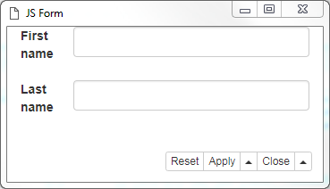

# Part 2 - Frontend

The frontend involves the web resources and dependencies configured. Every JS node must have one Javascript source that defines the view in a namespace that has the same name as configured in the backend.
This view must have the following methods if configured:
- init
- getComponentValue
- validate
- setValidationError

The names of these methods are not relevant as they can be configured in the backend. Only the init and getComponentValue methods are mandatory. The validation methods are optional.

## Example with vanilla JavaScript

```javascript
(jsform = function() {

    let _representation;
    let _value;

    let view = {};

    view.init = function(representation, value) {
        _representation = representation;
        _value = value;

        createUI();
    };

    view.getComponentValue = () => {
        _value.firstName = document.getElementById("firstName").value;
        _value.lastName = document.getElementById("lastName").value;

        return _value;
    };

    function createUI() {
        let body = document.getElementsByTagName("body")[0];
        body.innerHTML = `<h2>Example JS form</h2>
        <form>
          <p>First name: <input id="firstName" type="text" value="Dick"></p>
          <p>Last name: <input id="lastName" type="text" value="Grayson"></p>
        </form>`;
    }

    return view;
}());
```

This javascript produces the following view:


## Adding libraries

First the Web resource bundle in the backend needs to be added a webDependency for Bootstrap 3.3.6.


Now we can update our example with a Bootstrap form. Only the *createUI* method is updated:
```javascript
function createUI() {
    let body = document.getElementsByTagName("body")[0];
    body.innerHTML = `<div class="container-fluid">
      <form class="form-horizontal">
        <div class="form-group">
          <label class="col-sm-2 control-label">First name</label>
          <div class="col-sm-10">
            <input type="text" class="form-control" id="firstName">
          </div>
        </div>
        <div class="form-group">
          <label class="col-sm-2 control-label">Last name</label>
          <div class="col-sm-10">
            <input type="text" class="form-control" id="lastName">
          </div>
        </div>
      </form>
    </div>`;
}
```




## Example with CSS