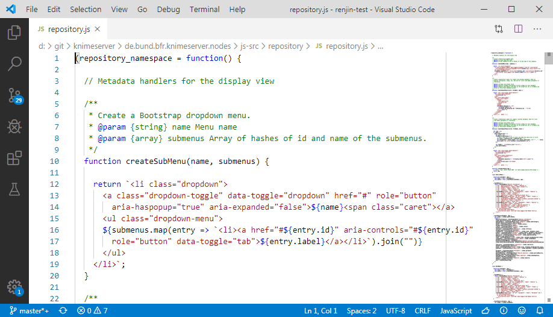

# Requirements
It is advised to bring all the applications needed for development already installed before the workshop.

## Java SE
For building KNIME and writing the node backend you will need the Java SE Development Kit. In this workshop it will be used at least Java 8. To find out if you already have Java installed you can execute the following command in a terminal and check the output.

    java --version

If Java is not installed, it can be downloaded from https://www.oracle.com/technetwork/java/javase/downloads/jdk13-downloads-5672538.html. Accept the license and choose between the Linux, macOS and Windows installation files.

## Tools

### Eclipse IDE for RCP and RAP Developers

Eclipse is a complete Java IDE provided by the Eclipse Foundation for Windows, Linux and macOS. It is recommended to install the package for RCP developers as this includes many editors and tools to work with Eclipse plugins (KNIME nodes). To install Eclipse please navigate to https://www.eclipse.org/downloads/packages/release/2019-12/r/eclipse-ide-rcp-and-rap-developers-includes-incubating-components and download the appropiate file for your OS.

### Visual Studio Code

While the frontend can be developed under Eclipse, it is desirable to use editors better suited for web development like Visual Studio Code (VSCode). VSCode is a lightweight open source code editor developed by Microsoft for Windows, Linux and macOS. It is available at https://code.visualstudio.com/Download.

